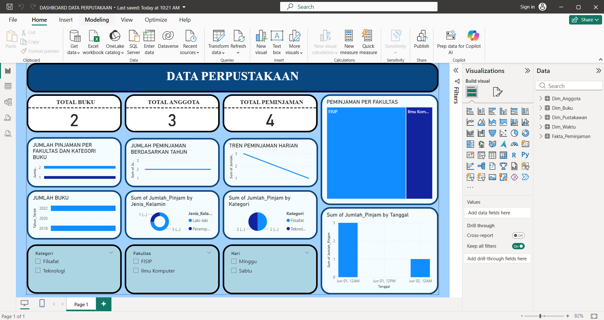

# Library Data Dashboard – Power BI

This project is a **data visualization dashboard** built using Power BI to analyze library data, including book collections, members, and borrowing activities.

The project was developed as part of my academic coursework to demonstrate data analysis and visualization skills.

---

## Project Objective

* Visualize library data in an interactive dashboard
* Analyze borrowing trends and user behavior
* Present insights in a clear and structured format
* Apply data modeling concepts (fact & dimension tables)

---

## Features

* Total Books, Members, and Borrowings overview
* Daily borrowing trend analysis
* Borrowing distribution by faculty
* Analysis by category, gender, and time
* Interactive filters (Category, Faculty, Day)
* Time-based analysis (Year & Date)

---

## Dashboard Preview

---

## Tech Stack

* **Tool**: Microsoft Power BI
* **Data Modeling**: Star Schema (Fact & Dimension Tables)
* **Data Source**: Simulated / academic dataset

---

## Data Structure

* **Fact Table**: Fakta_Peminjaman
* **Dimension Tables**:

  * Dim_Anggota
  * Dim_Buku
  * Dim_Pustakawan
  * Dim_Waktu

---

## Key Insights

* Identifies borrowing trends over time
* Shows distribution of borrowings across faculties
* Highlights user segmentation based on gender and category
* Provides quick overview of library performance

---

## Academic Context

This project was created as part of a university assignment to fulfill academic requirements and demonstrate understanding of:

* Data visualization
* Data modeling
* Business intelligence tools

---

## Author

**Kevin Wilmer Vittorio**
[kevinwilmerv07@gmail.com](mailto:kevinwilmerv07@gmail.com)

---

## Notes

This project is for learning and portfolio purposes and may be further improved in the future.
